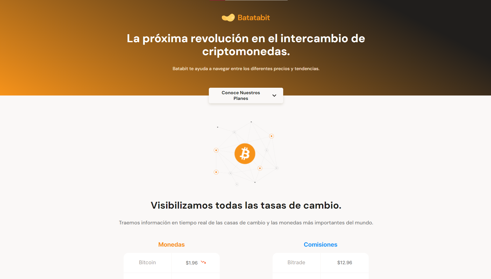
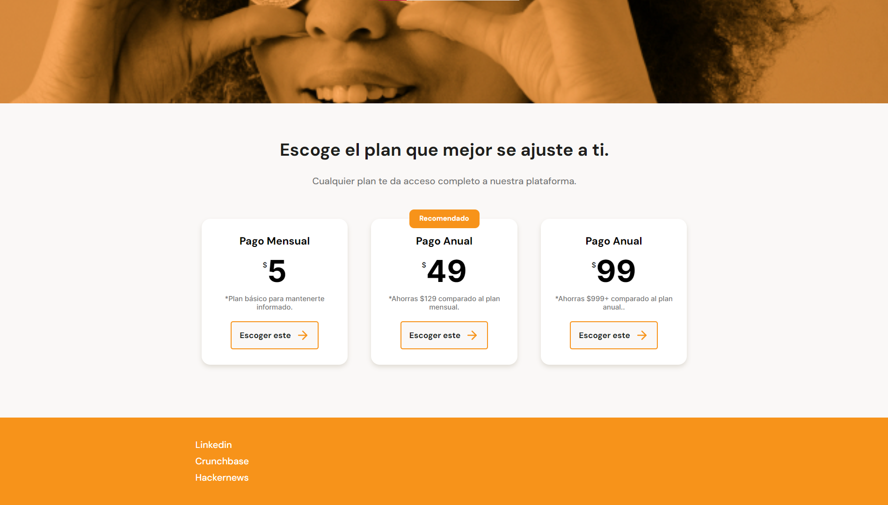
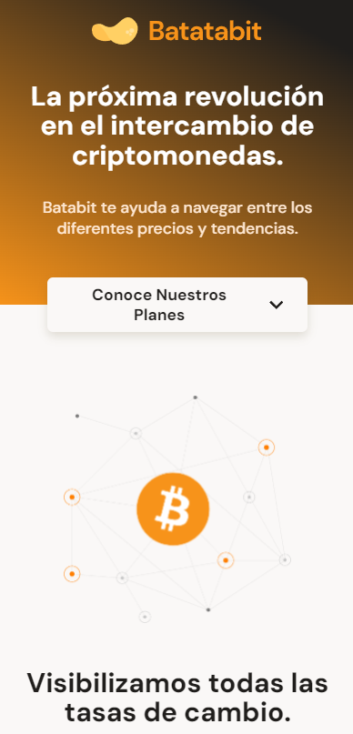

# Batatabit

<!-- Eco Store is a website of an ecological that helps customers find environmentally-friendly products made with artisanal techniques and materials that promote environmental conservation at affordable prices. Its goal is to facilitate customers in searching for and acquiring sustainable products to contribute to the well-being of the planet. -->

 

## Table of contents

- [Screenshot](#screenshot)
- [Link](#link)
- [Built with](#built-with)
- [What I learned](#what-i-learned)
- [Author](#author)

 

## Screenshot

<!-- 

 -->

 

## Link

<!-- - Live site URL: [Visit Eco Store](https://linen220.github.io/Eco-store-v2/) -->

 

## Built with

-    
-    

 

<!-- ## What I learned

* Usage of **flex** layout's properties in css.
* Used HTML5 semantic elements for better accessability and readability.
* Used media queries for responsive design.
* Used image carousel.
* Tried to maintain clean code.

 

# Author

- Frontend Mentor - [@Linen220](https://www.frontendmentor.io/profile/Linen220)
- Github - Linen220

  -->
