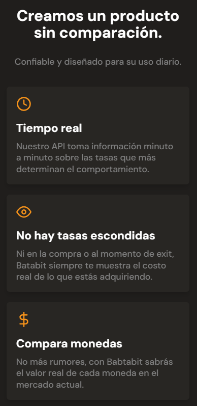

# Batatabit

Welcome to Batatabit.
Our Cryptocurrency Exchange Platform – Where Digital Assets Find New Homes!

Embark on a seamless journey of trading digital wealth with our cutting-edge cryptocurrency exchange. Whether you're a seasoned trader or just venturing into the world of digital currencies, our platform offers a secure and user-friendly environment for buying, selling, and exchanging various cryptocurrencies. Join us today and explore the future of financial transactions!

 

## Table of contents

- [Screenshot](#screenshot)
- [Link](#link)
- [Built with](#built-with)
- [What I learned](#what-i-learned)
- [Author](#author)

 

## Screenshot

 

## Link

- Live site URL: [Visit Batatabit](https://linen220.github.io/Batatabit-Mobile-First/)

 

## Built with

-    
-    

 

## What I learned

* Usage of **flex** layout's properties in css.
* Used HTML5 semantic elements for better accessability and readability.
* Used media queries for responsive design.
* Used image carousel.
* Usage of mobile first design.
* Tried to maintain clean code.

 

# Author

- Frontend Mentor - [@Linen220](https://www.frontendmentor.io/profile/Linen220)
- Github - Linen220

 
